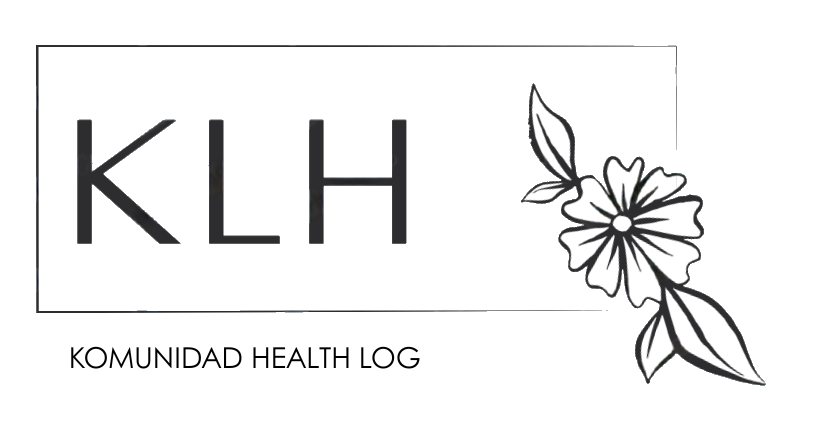

# Komunidad Health Log (KHL)

<p align="center">
  
</p>

<p align="center">
  <b>Empowering Midwives, Transforming Healthcare Data</b>
</p>

## 🌟 Welcome to Komunidad Health Log

Komunidad Health Log (KLH) is a revolutionary mobile application designed to streamline the data collection, consolidation, and reporting workflows for midwives working with the Field Health Services Information System (FHSIS) in the Philippines. Our mission is to transform the way healthcare data is managed at the grassroots level, making it more efficient, accurate, and accessible.

## 💡 Key Features

### 📊 Intuitive Dashboard

- At-a-glance statistics on households, pregnant women, and children
- Real-time notifications for important health events
- Integrated calendar for appointment tracking

### 👨‍👩‍👧‍👦 Household Management

- Comprehensive household profiling
- Family member health records
- Geolocation mapping for easy navigation

### 🩺 Consultation Tracking

- Digital consultation records
- Maternal and child health monitoring
- Immunization scheduling and tracking

### 📝 Automated Reporting

- FHSIS-compliant report generation
- Customizable reporting periods
- Data validation to ensure accuracy

### 📈 Analytics & Insights

- Trend analysis for health indicators
- Performance metrics for healthcare workers
- Community health status visualization

## 🚀 Getting Started

### Prerequisites

- Flutter 3.0 or higher
- Dart 2.17 or higher
- Firebase account for backend services

### Installation

1. Clone the repository:

   ```bash
   git clone https://github.com/PHPros/klh_prototype_2.git
   ```

2. Navigate to the project directory:

   ```bash
   cd klh_prototype_2
   ```

3. Install dependencies:

   ```bash
   flutter pub get
   ```

4. Run the application:
   ```bash
   flutter run
   ```

## 🌐 Why Komunidad Health Log?

### For Midwives

- Reduce paperwork by up to 70%
- Access patient information instantly
- Generate reports with a single tap
- Work offline in areas with limited connectivity

### For Health Officials

- Real-time data for decision-making
- Standardized information across regions
- Improved data quality and completeness
- Enhanced monitoring capabilities

### For Communities

- Better continuity of care
- Improved health outcomes through data-driven interventions
- Stronger connection with healthcare providers

## 🔮 Future Roadmap

- **Integration with National Health Systems**: Connect with PhilHealth and other national databases
- **Expanded Analytics**: Advanced predictive analytics for health trends
- **Community Engagement Tools**: Direct communication channels with patients
- **Telemedicine Features**: Remote consultation capabilities for rural areas

<p align="center">
  Made with ❤️ for Filipino healthcare workers
</p>
